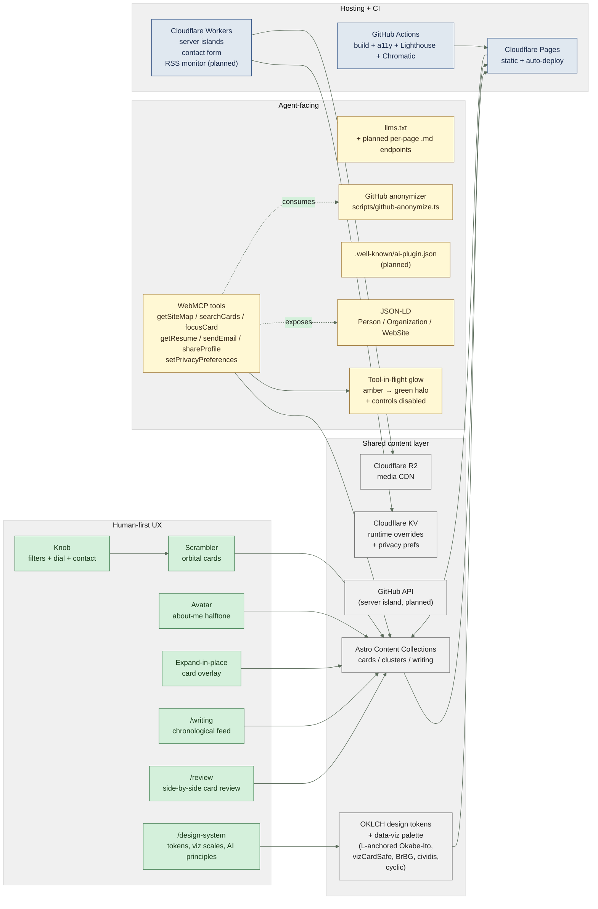

# Architecture

dadeda.design is a dual-audience system: human-first UX paths AND agent-focused / WebMCP-enabled paths share the same content layer. The diagram below is the source of truth — rendered on the site at `/how-this-works` and consumable as Markdown by agents.

## Encoding

- **Green** nodes: human-first UX surfaces. The Scrambler orbital interaction is the navigation; Knob, Avatar, expanded card overlays are interactive surfaces; `/writing`, `/review`, `/design-system` are companion routes.
- **Amber** nodes: agent-facing surfaces. WebMCP tools (10 registered), `llms.txt`, JSON-LD structured data, the planned ai-plugin.json manifest, the tool-in-flight glow, and the offline anonymizer that produces the post-launch D1 / D2 viz dataset.
- **Neutral grey** nodes: the shared content layer that both audiences read from. Astro Content Collections (cards / clusters / writing — typed YAML schema validated by Zod), the OKLCH design tokens (brand + viz palette), GitHub API, R2 media CDN, KV for runtime overrides + privacy preferences.
- **Blue** nodes: hosting + CI infrastructure. Cloudflare Pages for static delivery, Workers for server islands and form handling, GitHub Actions for build + a11y + Lighthouse + visual regression.

## Why dual-audience by design

A site that lists tools, shares a profile, and surfaces work should be just as legible to an agent acting on a human's behalf as it is directly to a human in a browser. The architecture treats both as first-class consumers — the same content collection feeds both, the same privacy preferences govern both, the same accessibility wins (semantic HTML, alt text, ARIA landmarks) help both. Agent transparency, cognitive amplification, taste-conducive interaction, privacy-by-design defaults, and progressive enhancement are the principles documented in `/design-system` under AI Interaction Design.
